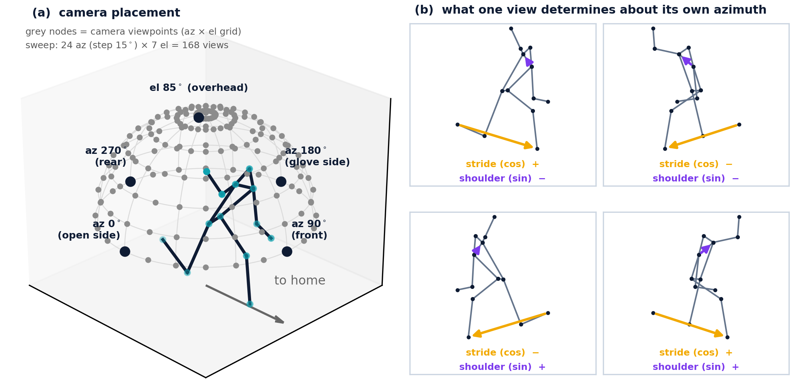
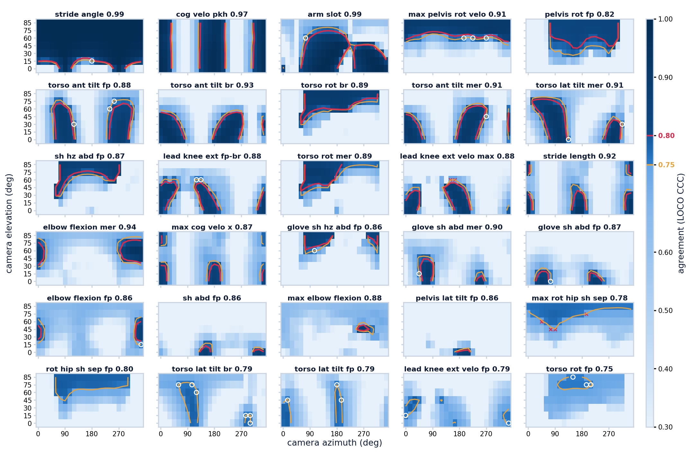

# Measurability of Baseball Pitching Biomechanics From a Single 2D View

Code and derived tables for the paper of that name.

Each 3D pitch of the Driveline OpenBiomechanics Project is projected to a virtual camera
swept over 24 azimuths and 7 elevations, giving 168 viewpoints. At every viewpoint a 2D
estimator measures a quantity and is scored against that pitch's own 3D ground truth.
The result is a graded measurability map over (quantity × viewpoint).



## What is here, and what is not

Included: the projection, the estimators, the grading protocol, the scripts that produce
every table and figure of the paper, the frozen population identifiers with their
checksum, and the row-by-row specification of all 42 estimators.

**Not included: the OpenBiomechanics recordings.** They are Driveline's public release
and are cited rather than redistributed. `population_frozen.csv` names the 394 pitches
used, and `population_frozen_checksum.txt` fixes that set, so the same population can be
pulled from the original download.

Also not included are the author's own video recordings, which show an identifiable
person and are not needed to reproduce anything in the map. Sections V to VII of the
paper rest entirely on the marker trajectories.

## Getting the data

1. Download the OpenBiomechanics Project from <https://openbiomechanics.org/>.
2. Place it so that the following resolves:
   `<root>/data/datasets/OBP/openbiomechanics/baseball_pitching/data`
3. Set `DIAMOND_ROOT` if the tree is not where `src/config.py` sits, and confirm the
   population:

```
python src/analysis/population_freeze.py
```

That prints the SHA-256 of the frozen set. It must match
`data/outputs/obp_validation/population_frozen_checksum.txt`:

```
03cae5199acaa11ab1147d0461546da6fc98128896b455b7d2b488ecef654f24  394 pitches  98 pitchers
```

A different checksum means a different release of the dataset, and nothing below will
reproduce.

## Environment

```
conda env create -f environment.yml
conda activate diamond
```

Scripts use relative `sys.path` inserts and are run from their own directory:

```
cd src/analysis
python paper_registry.py
```

## What produces what

Every number in the paper comes from one of these tables. None is typed into a document.

| table | produced by |
|---|---|
| `paper_registry.csv` — the 42 evaluated rows | `analysis/paper_registry.py` |
| `population_frozen.csv`, `population_frozen_checksum.txt` | `analysis/population_freeze.py` |
| `gate_map.csv`, `layer_summary.csv` — the graded map | `analysis/gate_map.py`, `analysis/layer_report.py` |
| `accuracy_map_gt_clean.csv`, `accuracy_bestcell_gt_clean.csv` | `analysis/accuracy_map.py` |
| `continuity_rows.csv`, `continuity_arcs.csv` — azimuthal arcs | `analysis/continuity_map.py` |
| `hss_elevation.csv`, `fp_target_*.csv` | `analysis/viewpoint_anchor_check.py` |
| `event_tolerance_map.csv` — temporal precision | `analysis/event_tolerance_map.py` |
| `coverage_accounting.csv` — disposition of all 81 columns | `analysis/coverage_accounting.py` |
| `inference_trajectory.csv` — the 34 kinetic targets | `research/inference_trajectory.py` |
| `estimator_spec.csv` — all 42 estimators, row by row | shipped |
| `detector_spec.csv` — the event detectors | shipped |
| `realvideo_support_matrix.csv` | `analysis/realvideo_support_matrix.py` |

Figures, each authored at the width it is placed at:

| figure | script |
|---|---|
| 1 camera geometry | `viz/fig_camera_geometry.py` |
| 2 measurement pathway | `viz/fig_pathway.py` |
| 3 graded measurability map | `viz/fig_graded_map.py` |
| 4 per-row arcs and verdicts | `viz/fig_row_summary.py` |
| 5 hip–shoulder separation by elevation | `viz/fig_hss_elevation.py` |
| 6 kinetic inference | `viz/fig_inference_kinetics.py` |
| 7 what each anchor reads on real video | `viz/fig_anchor_orientation.py` |
| 8 overhead hip–shoulder separation | `viz/fig_overhead_hss.py` |

Figures 7 and 8 read the author's video recordings, which are not included, so they
cannot be regenerated from this release. The published PNGs are under `figures/`.

## The accounting



One panel per retained row, agreement over azimuth and elevation, with the two
grade contours drawn on the field rather than a single pass line.

```
81 point-of-interest columns = 5 metadata + 34 kinetic + 42 kinematic
42 kinematic columns         = 42 evaluated rows, one estimator each
42 evaluated rows            = 30 retained + 12 reaching no graded cell
30 retained rows             = 5,040 cells, of which 1,151 are graded
1,151 graded cells           = 819 strong (CCC >= 0.80) + 332 moderate (0.75 to 0.80)
population                   = 411 - 10 no usable event - 7 implausible foot plant = 394
                               pitches by 98 pitchers
```

The map is measured under five favourable conditions, the first being that the 2D pose
is a clean projection of the 3D truth rather than an estimate from video. It is an upper
bound, and Section VI of the paper tests four of the five.

## Licence

Code under the MIT Licence, derived tables and figures under CC BY 4.0. See `LICENSE`.
The OpenBiomechanics data carries its own licence and is not redistributed here.
